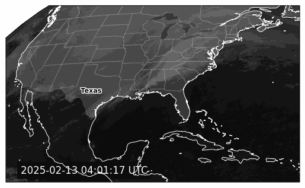
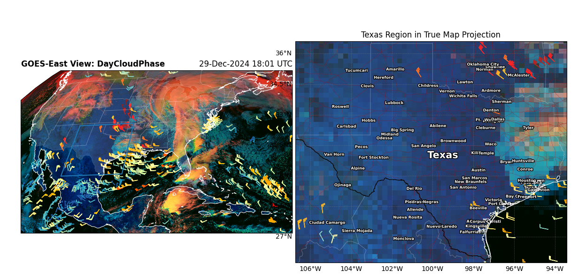
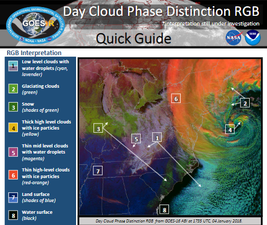
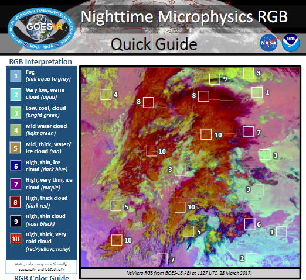

## Geographical Application Test

### Steps:
1. [CTRL] + [SHIFT] + [P]
1. Select Interpreter
1. Create a .venv within the project
1. pip install -r requirements.txt
1. Documentation: https://blaylockbk.github.io/goes2go/_build/html/

When you run: `python test.py`:

When you run `python main.py`:

Which refers to the key:

Note: If it switches to `NighttimeMicrophysics` instead of `DayCloudPhase`, refer to:

